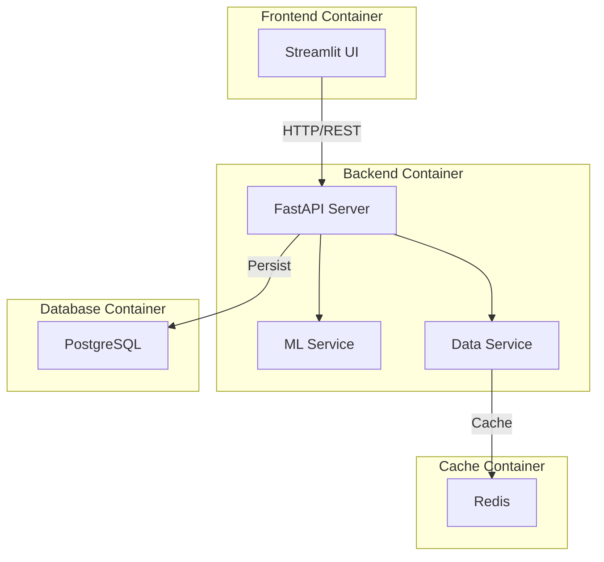

# 設計書

## 概要

本システムは、機械学習モデルの学習・評価・可視化を行うWebダッシュボードである。Streamlitによるフロントエンド、FastAPIによるバックエンド、Redis/PostgreSQLによるデータ永続化で構成される。ユーザーはブラウザからデータセットとモデルを選択し、ハイパーパラメータを調整して学習を実行し、評価指標と可視化結果をリアルタイムで確認できる。

## アーキテクチャ

システムは以下の4つの主要コンポーネントで構成される：



### プロジェクト構成

プロジェクトはuvで管理されるモノレポ構成：

```
ml-visualization-dashboard/
├── pyproject.toml              # ルートプロジェクト設定
├── uv.lock                     # 依存関係ロックファイル
├── .env.example                # 環境変数テンプレート
├── docker-compose.yml          # Docker Compose設定
├── backend/
│   ├── pyproject.toml          # バックエンド依存関係
│   ├── Dockerfile
│   ├── .env.example
│   └── src/
│       ├── main.py             # FastAPIアプリケーション
│       ├── config.py           # 環境変数設定
│       ├── models/             # Pydanticモデル
│       ├── services/           # ビジネスロジック
│       ├── repositories/       # データアクセス
│       └── api/                # APIエンドポイント
└── frontend/
    ├── pyproject.toml          # フロントエンド依存関係
    ├── Dockerfile
    ├── .env.example
    └── src/
        ├── app.py              # Streamlitメインアプリ
        ├── config.py           # 環境変数設定
        ├── api_client.py       # APIクライアント
        └── components/         # UIコンポーネント
```

### レイヤー構成

1. **プレゼンテーション層（Streamlit）**
   - ユーザーインターフェース
   - サイドバーでのパラメータ設定
   - メイン領域での結果表示
   - 環境変数によるバックエンドURL設定

2. **アプリケーション層（FastAPI）**
   - RESTful APIエンドポイント
   - リクエスト検証とレスポンス整形
   - ビジネスロジックの調整
   - 環境変数によるCORS設定

3. **ドメイン層（ML Service / Data Service）**
   - モデル学習ロジック
   - データセット管理
   - 評価指標計算

4. **データ層（Redis / PostgreSQL）**
   - データセットキャッシング
   - 実験履歴の永続化

## コンポーネントとインターフェース

### 1. Streamlit Frontend

**責務:**
- ユーザー入力の収集
- APIリクエストの送信
- 結果の可視化
- バックエンドURL管理

**環境変数設定:**
```python
# config.py
from pydantic_settings import BaseSettings

class Settings(BaseSettings):
    # バックエンドAPI設定
    api_base_url: str = "http://localhost:8000"
    api_timeout: int = 30
    
    # アプリケーション設定
    app_title: str = "ML Dashboard"
    app_icon: str = "🤖"
    
    class Config:
        env_file = ".env"

settings = Settings()
```

**主要モジュール:**
- `app.py`: メインアプリケーション
- `config.py`: 環境変数設定
- `components/sidebar.py`: サイドバーUI
- `components/metrics.py`: メトリクス表示
- `components/visualizations.py`: グラフ描画
- `api_client.py`: バックエンドAPIクライアント

**インターフェース:**
```python
# APIクライアント
class MLAPIClient:
    def __init__(self, base_url: str):
        self.base_url = base_url
    
    def get_dataset(dataset_name: str) -> DatasetResponse
    def train_model(config: TrainingConfig) -> TrainingResult
    def save_experiment(experiment: ExperimentData) -> bool
    def get_experiment_history() -> List[ExperimentRecord]
    def clear_history() -> bool
    def export_model(model_id: str) -> bytes
```

### 2. FastAPI Backend

**責務:**
- APIエンドポイントの提供
- リクエスト検証
- サービス層の調整
- CORS設定管理

**環境変数設定:**
```python
# config.py
from pydantic_settings import BaseSettings

class Settings(BaseSettings):
    # データベース設定
    postgres_host: str = "localhost"
    postgres_port: int = 5432
    postgres_user: str = "postgres"
    postgres_password: str = "postgres"
    postgres_db: str = "ml_dashboard"
    
    # Redis設定
    redis_host: str = "localhost"
    redis_port: int = 6379
    redis_db: int = 0
    
    # CORS設定
    cors_origins: str = "*"  # カンマ区切りで複数指定可能
    cors_allow_credentials: bool = True
    cors_allow_methods: str = "*"
    cors_allow_headers: str = "*"
    
    # アプリケーション設定
    api_host: str = "0.0.0.0"
    api_port: int = 8000
    
    class Config:
        env_file = ".env"

settings = Settings()
```

**CORS設定:**
```python
from fastapi.middleware.cors import CORSMiddleware

app = FastAPI()

# 環境変数からCORS設定を読み込み
origins = settings.cors_origins.split(",") if settings.cors_origins != "*" else ["*"]

app.add_middleware(
    CORSMiddleware,
    allow_origins=origins,
    allow_credentials=settings.cors_allow_credentials,
    allow_methods=settings.cors_allow_methods.split(",") if settings.cors_allow_methods != "*" else ["*"],
    allow_headers=settings.cors_allow_headers.split(",") if settings.cors_allow_headers != "*" else ["*"],
)
```

**主要エンドポイント:**
```python
# データセット関連
GET  /api/datasets                    # 利用可能なデータセット一覧
GET  /api/datasets/{name}             # データセット取得
GET  /api/datasets/{name}/preview     # データプレビュー

# モデル学習関連
POST /api/train                       # モデル学習実行
GET  /api/models/{model_id}           # モデル情報取得
GET  /api/models/{model_id}/export    # モデルエクスポート

# 実験履歴関連
POST /api/experiments                 # 実験記録保存
GET  /api/experiments                 # 実験履歴取得
DELETE /api/experiments               # 実験履歴クリア
```

**データモデル（Pydantic）:**
```python
class TrainingConfig(BaseModel):
    dataset_name: str
    test_size: float
    random_state: int
    model_type: str
    hyperparameters: Dict[str, Any]

class TrainingResult(BaseModel):
    model_id: str
    accuracy: float
    f1_score: float
    confusion_matrix: List[List[int]]
    classification_report: Dict[str, Any]
    feature_importances: Optional[List[float]]
    training_time: float

class ExperimentRecord(BaseModel):
    id: int
    timestamp: datetime
    dataset_name: str
    model_type: str
    accuracy: float
    f1_score: float
    hyperparameters: Dict[str, Any]
```

### 3. ML Service

**責務:**
- モデルのインスタンス化
- 学習実行
- 評価指標計算
- 特徴量重要度抽出

**主要クラス:**
```python
class ModelFactory:
    @staticmethod
    def create_model(model_type: str, hyperparameters: Dict) -> BaseEstimator
    
class ModelTrainer:
    def train(model: BaseEstimator, X_train, y_train) -> BaseEstimator
    def evaluate(model: BaseEstimator, X_test, y_test) -> EvaluationMetrics
    
class MetricsCalculator:
    @staticmethod
    def calculate_accuracy(y_true, y_pred) -> float
    @staticmethod
    def calculate_f1_score(y_true, y_pred) -> float
    @staticmethod
    def generate_confusion_matrix(y_true, y_pred) -> np.ndarray
    @staticmethod
    def generate_classification_report(y_true, y_pred) -> Dict
    @staticmethod
    def extract_feature_importances(model: BaseEstimator) -> Optional[List[float]]
```

### 4. Data Service

**責務:**
- データセット読み込み
- キャッシング管理
- データ前処理

**主要クラス:**
```python
class DatasetLoader:
    def __init__(redis_client: Redis)
    def load_dataset(name: str) -> Dataset
    def get_available_datasets() -> List[str]
    
class DataPreprocessor:
    @staticmethod
    def split_data(X, y, test_size: float, random_state: int) -> Tuple
    @staticmethod
    def prepare_preview(dataset: Dataset, n_rows: int) -> pd.DataFrame
```

### 5. Database Service

**責務:**
- 実験記録の永続化
- 履歴クエリ

**主要クラス:**
```python
class ExperimentRepository:
    def __init__(db_session: Session)
    def save_experiment(experiment: ExperimentRecord) -> int
    def get_all_experiments() -> List[ExperimentRecord]
    def clear_all_experiments() -> bool
```

## データモデル

### PostgreSQLスキーマ

```sql
-- 実験記録テーブル
CREATE TABLE experiments (
    id SERIAL PRIMARY KEY,
    timestamp TIMESTAMP NOT NULL DEFAULT CURRENT_TIMESTAMP,
    dataset_name VARCHAR(50) NOT NULL,
    model_type VARCHAR(50) NOT NULL,
    accuracy FLOAT NOT NULL,
    f1_score FLOAT NOT NULL,
    hyperparameters JSONB NOT NULL,
    training_time FLOAT NOT NULL
);

CREATE INDEX idx_experiments_timestamp ON experiments(timestamp DESC);
CREATE INDEX idx_experiments_accuracy ON experiments(accuracy DESC);
```

### Redisキャッシュ構造

```
Key: dataset:{dataset_name}
Value: Pickled Dataset Object
TTL: 3600 seconds (1 hour)

Structure:
{
    "data": numpy.ndarray,
    "target": numpy.ndarray,
    "feature_names": List[str],
    "target_names": List[str],
    "DESCR": str
}
```

### セッション状態（Streamlit）

```python
# st.session_state
{
    "current_model": Optional[BaseEstimator],
    "current_model_id": Optional[str],
    "last_training_result": Optional[TrainingResult],
    "experiment_history": List[ExperimentRecord],
    "selected_dataset": str,
    "selected_model": str,
    "hyperparameters": Dict[str, Any]
}
```


## 正確性プロパティ

*プロパティとは、システムのすべての有効な実行において真であるべき特性や動作のことである。プロパティは、人間が読める仕様と機械で検証可能な正確性保証の橋渡しとなる。*

### プロパティ1: データセット読み込みの完全性

*任意の*有効なデータセット名に対して、データセットを読み込んだ後、メタデータ（データセット名、サンプル数、特徴量数）がすべて存在し、データとターゲットが空でないこと
**検証: 要件 1.1, 1.5**

### プロパティ2: データ分割比率の正確性

*任意の*10%から50%の範囲のテスト分割比率に対して、実際のテストセットサイズが指定された比率の±1%以内であること
**検証: 要件 1.2**

### プロパティ3: 乱数シードによる再現性

*任意の*乱数シード値に対して、同じシードで2回データ分割を実行した場合、train/testセットが完全に一致すること
**検証: 要件 1.3**

### プロパティ4: データプレビューの正確性

*任意の*データセットとプレビュー行数Nに対して、プレビューテーブルが正確にN行（またはデータセットの全行数がN未満の場合はその行数）を含み、すべての特徴量列とラベル列が存在すること
**検証: 要件 1.4**

### プロパティ5: モデル別ハイパーパラメータ表示

*任意の*モデルタイプに対して、表示されるハイパーパラメータセットがそのモデルタイプに適切なパラメータのみを含むこと（例: Random Forestにはn_estimators、max_depthが含まれ、learning_rateは含まれない）
**検証: 要件 2.1**

### プロパティ6: ハイパーパラメータ更新の一貫性

*任意の*ハイパーパラメータ（n_estimators、max_depth、min_samples_split、learning_rate、C、k）と有効な値に対して、パラメータを設定した後、モデル設定から取得した値が設定した値と一致すること
**検証: 要件 2.2, 2.3, 2.4, 2.5, 2.6, 2.7**

### プロパティ7: モデル学習の成功

*任意の*有効なモデル設定とデータセットの組み合わせに対して、学習を実行すると評価指標（accuracy、f1_score）を含む結果が返されること
**検証: 要件 3.1**

### プロパティ8: 学習完了後のメトリクス更新

*任意の*モデル学習実行後、すべての必須メトリクス（accuracy、f1_score、model_name、confusion_matrix、classification_report）が更新され、None以外の値を持つこと
**検証: 要件 3.3, 4.1, 4.2, 4.3, 4.4, 4.6**

### プロパティ9: エラー時の状態不変性

*任意の*無効な学習設定（例: 存在しないデータセット名）に対して、学習を試みた場合、エラーが返され、以前の学習結果が変更されないこと
**検証: 要件 3.4**

### プロパティ10: 特徴量重要度の降順性

*任意の*木ベースモデル（Random Forest、Gradient Boosting）の学習後、特徴量重要度リストが降順にソートされていること
**検証: 要件 4.5**

### プロパティ11: パラメータ保存のラウンドトリップ

*任意の*ハイパーパラメータ設定に対して、データベースに保存してから取得した設定が、元の設定と等しいこと
**検証: 要件 5.1**

### プロパティ12: 実験記録の完全性

*任意の*学習実行完了後、データベースに保存された実験記録が、モデルタイプ、データセット名、accuracy、f1_score、hyperparameters、timestampのすべてのフィールドを含むこと
**検証: 要件 5.2**

### プロパティ13: 実験履歴の時系列順序

*任意の*実験記録セットに対して、取得した履歴リストがtimestampの降順（最新が先頭）にソートされていること
**検証: 要件 5.3**

### プロパティ14: 最良モデルの識別

*任意の*複数の実験記録に対して、最良モデルとして識別されるものが、最高accuracyを持つ実験であること
**検証: 要件 5.4**

### プロパティ15: 履歴クリアの完全性

*任意の*実験記録セットに対して、履歴リセットを実行した後、データベースから取得される実験記録が空リストであること
**検証: 要件 5.5**

### プロパティ16: モデルシリアライゼーションのラウンドトリップ

*任意の*学習済みモデルに対して、pickleにシリアライズしてからデシリアライズしたモデルが、同じテストデータに対して同じ予測結果を生成すること
**検証: 要件 6.1**

### プロパティ17: データセットキャッシュの保存

*任意の*データセット名に対して、初回リクエスト後、Redisキャッシュにそのデータセットのキーが存在すること
**検証: 要件 7.1**

### プロパティ18: キャッシュからの取得

*任意の*キャッシュ済みデータセットに対して、2回目のリクエストで取得されるデータが、1回目のリクエストで取得されたデータと等しいこと
**検証: 要件 7.2**

### プロパティ19: APIレスポンスの適切性

*任意の*有効なAPIリクエストに対して、レスポンスが適切なステータスコード（2xx）とデータ構造を持つこと。無効なリクエストに対しては、エラーステータスコード（4xx）とエラーメッセージを持つこと
**検証: 要件 8.6**

### プロパティ20: CORS設定の環境変数制御

*任意の*CORS設定値に対して、環境変数で設定した値がFastAPIアプリケーションのCORSミドルウェアに正しく適用されること
**検証: 要件 8.7**

### プロパティ21: フロントエンドAPI接続の環境変数制御

*任意の*バックエンドURL設定に対して、環境変数で設定したURLがStreamlitアプリケーションのAPIクライアントで使用されること
**検証: 要件 8.8**

### プロパティ22: モノレポ構成の独立性

*任意の*サブプロジェクト（frontend、backend）に対して、それぞれ独立したpyproject.tomlファイルを持ち、uvで個別に依存関係を管理できること
**検証: 要件 10.2, 10.3**

## エラーハンドリング

### エラーカテゴリ

1. **データセットエラー**
   - 存在しないデータセット名
   - データ読み込み失敗
   - キャッシュ接続エラー

2. **モデル学習エラー**
   - 無効なハイパーパラメータ
   - 学習中の例外
   - メモリ不足

3. **データベースエラー**
   - 接続失敗
   - クエリエラー
   - トランザクション失敗

4. **API通信エラー**
   - タイムアウト
   - ネットワークエラー
   - 無効なリクエスト形式

### エラーハンドリング戦略

```python
# FastAPI エラーハンドラー
@app.exception_handler(DatasetNotFoundError)
async def dataset_not_found_handler(request: Request, exc: DatasetNotFoundError):
    return JSONResponse(
        status_code=404,
        content={"error": "Dataset not found", "detail": str(exc)}
    )

@app.exception_handler(ModelTrainingError)
async def training_error_handler(request: Request, exc: ModelTrainingError):
    return JSONResponse(
        status_code=500,
        content={"error": "Model training failed", "detail": str(exc)}
    )

@app.exception_handler(DatabaseError)
async def database_error_handler(request: Request, exc: DatabaseError):
    return JSONResponse(
        status_code=503,
        content={"error": "Database operation failed", "detail": str(exc)}
    )
```

### リトライ戦略

- **Redis接続**: 3回リトライ、指数バックオフ（1s, 2s, 4s）
- **PostgreSQL接続**: 5回リトライ、指数バックオフ（1s, 2s, 4s, 8s, 16s）
- **API呼び出し（Streamlit側）**: 2回リトライ、固定間隔（2s）

### ログ戦略

```python
# 構造化ログ
import logging
import json

logger = logging.getLogger(__name__)

def log_training_start(config: TrainingConfig):
    logger.info(json.dumps({
        "event": "training_start",
        "dataset": config.dataset_name,
        "model": config.model_type,
        "timestamp": datetime.now().isoformat()
    }))

def log_training_error(config: TrainingConfig, error: Exception):
    logger.error(json.dumps({
        "event": "training_error",
        "dataset": config.dataset_name,
        "model": config.model_type,
        "error": str(error),
        "timestamp": datetime.now().isoformat()
    }))
```

## テスト戦略

### 単体テスト

**対象:**
- データ処理関数（データセット読み込み、前処理）
- モデルファクトリー（モデルインスタンス化）
- メトリクス計算関数
- データベースリポジトリ操作

**ツール:**
- pytest
- pytest-mock（モッキング）
- pytest-cov（カバレッジ）

**例:**
```python
def test_dataset_loader_returns_valid_structure():
    loader = DatasetLoader(redis_client=mock_redis)
    dataset = loader.load_dataset("iris")
    assert dataset.data is not None
    assert dataset.target is not None
    assert len(dataset.feature_names) > 0

def test_model_factory_creates_correct_model():
    model = ModelFactory.create_model("random_forest", {"n_estimators": 100})
    assert isinstance(model, RandomForestClassifier)
    assert model.n_estimators == 100
```

### プロパティベーステスト

**対象:**
- 正確性プロパティ1〜19の検証

**ツール:**
- Hypothesis（Pythonのプロパティベーステストライブラリ）

**設定:**
- 各プロパティテストは最低100回の反復実行
- 各テストには設計書のプロパティ番号を明示的にコメントで記載

**例:**
```python
from hypothesis import given, strategies as st

# **Feature: ml-visualization-dashboard, Property 3: 乱数シードによる再現性**
@given(
    dataset_name=st.sampled_from(["iris", "wine", "breast_cancer"]),
    test_size=st.floats(min_value=0.1, max_value=0.5),
    random_state=st.integers(min_value=0, max_value=10000)
)
@settings(max_examples=100)
def test_random_seed_reproducibility(dataset_name, test_size, random_state):
    """プロパティ3: 同じシードで2回分割した結果が一致する"""
    dataset = load_dataset(dataset_name)
    
    X_train1, X_test1, y_train1, y_test1 = split_data(
        dataset.data, dataset.target, test_size, random_state
    )
    X_train2, X_test2, y_train2, y_test2 = split_data(
        dataset.data, dataset.target, test_size, random_state
    )
    
    assert np.array_equal(X_train1, X_train2)
    assert np.array_equal(X_test1, X_test2)
    assert np.array_equal(y_train1, y_train2)
    assert np.array_equal(y_test1, y_test2)

# **Feature: ml-visualization-dashboard, Property 16: モデルシリアライゼーションのラウンドトリップ**
@given(
    model_type=st.sampled_from(["random_forest", "logistic_regression"]),
    n_samples=st.integers(min_value=50, max_value=200)
)
@settings(max_examples=100)
def test_model_serialization_roundtrip(model_type, n_samples):
    """プロパティ16: シリアライズ→デシリアライズで予測結果が一致する"""
    # テストデータ生成
    X, y = make_classification(n_samples=n_samples, n_features=4, n_classes=2)
    X_train, X_test, y_train, y_test = train_test_split(X, y, test_size=0.3)
    
    # モデル学習
    model = create_model(model_type, {})
    model.fit(X_train, y_train)
    predictions_before = model.predict(X_test)
    
    # シリアライズ→デシリアライズ
    serialized = pickle.dumps(model)
    deserialized_model = pickle.loads(serialized)
    predictions_after = deserialized_model.predict(X_test)
    
    assert np.array_equal(predictions_before, predictions_after)
```

### 統合テスト

**対象:**
- APIエンドポイントの統合動作
- データベース接続とクエリ
- Redis接続とキャッシング

**ツール:**
- pytest
- TestClient（FastAPI）
- testcontainers（Docker統合テスト）

**例:**
```python
from fastapi.testclient import TestClient
from testcontainers.postgres import PostgresContainer
from testcontainers.redis import RedisContainer

def test_train_endpoint_integration():
    with PostgresContainer() as postgres, RedisContainer() as redis:
        # テスト用アプリケーション起動
        app = create_app(postgres.get_connection_url(), redis.get_connection_url())
        client = TestClient(app)
        
        # 学習リクエスト
        response = client.post("/api/train", json={
            "dataset_name": "iris",
            "test_size": 0.3,
            "random_state": 42,
            "model_type": "random_forest",
            "hyperparameters": {"n_estimators": 10}
        })
        
        assert response.status_code == 200
        result = response.json()
        assert "accuracy" in result
        assert "f1_score" in result
        assert result["accuracy"] > 0
```

### E2Eテスト

**対象:**
- Streamlit UIからバックエンドまでの完全なフロー

**ツール:**
- Selenium（ブラウザ自動化）
- pytest

**スコープ:**
- E2Eテストは時間がかかるため、最小限の重要フローのみをカバー
- CI/CDパイプラインでは夜間実行

### テスト実行順序

1. 単体テスト（最速、常時実行）
2. プロパティベーステスト（中速、コミット前実行）
3. 統合テスト（中速、コミット前実行）
4. E2Eテスト（最遅、夜間実行）

### カバレッジ目標

- 単体テスト: 80%以上のコードカバレッジ
- プロパティベーステスト: すべての正確性プロパティをカバー
- 統合テスト: すべてのAPIエンドポイントをカバー
